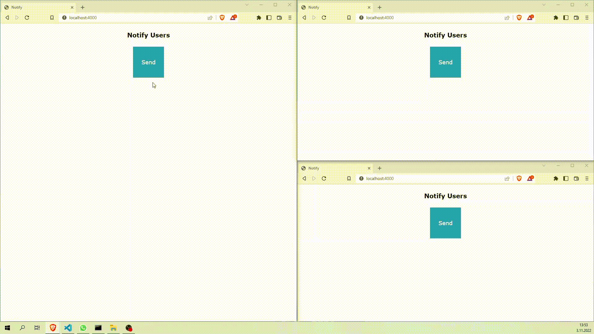

# real-time notifications 📝  
This is a simple notification app that will send a notification to everyone except the sender. Its sole purpose is to demonstrate how to use a basic socket.io and notification system. You are welcome to share any ideas with me👾

  

## Run Locally 🚀   

Clone the project  

~~~bash  
git clone https://github.com/ruveydayilmaz/realtime-notifications.git
~~~

Go to the project directory  

~~~bash  
cd realtime-notifications
~~~

Install dependencies  

~~~bash  
npm install
~~~

Start the project  

~~~bash  
npm start
~~~  

## Screenshots  

## Feedback  

If you have any feedback, please reach out to me at ruveydanryilmaz@gmail.com